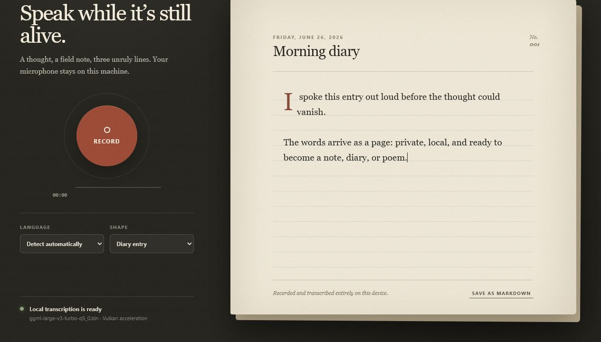

# Aervellum

Aervellum is a private, local-first voice-notes app that records microphone audio,
transcribes it with local Whisper models, and typesets the result as an editable
entry, diary page, or poem on a textured paper surface.

This project was made as a side activity. I always felt that it was really
tiring to type out everything or handwrite my thoughts, and I would often lose
the train of thought I was having while typing or writing it down. I felt this
especially when I was writing my diary or trying to quickly take down idea
notes. 

I tried looking for dedicated apps that could record and transcribe my voice notes on the fly, 
though admittedly not with a huge amount of effort, and eventually decided to make my own.

The app currently has three main writing shapes:

- Entry
- Diary
- Poem

All models should run locally. Right now, I have it set up so that I can host
the app on my computer and connect to the hosted site through Tailscale. I am
planning to turn it into an app that can be downloaded so it is fully local on a
phone too, but there are also good reasons to keep the hosted option: as long as
you are connected to your Tailscale network, you can access all of your notes
from anywhere.

The goal is for Aervellum to run on most personal systems, including NVIDIA GPU
machines, Intel/CPU-only computers, and macOS devices. This portability work is
still ongoing, so support outside the original Windows + AMD Vulkan setup may be
buggy while the project is still young.

If anyone is interested in progressing this project further, do not hesitate to
let me know. I love open-source software, so I am planning to do the same with
this. I was able to create this with the help of Codex.



The workspace also contains a native iPhone companion in `ios/AervellumDiary/`.
It uses WhisperKit/Core ML for on-device transcription and SwiftData for a
private diary archive. See its own README for Mac/Xcode build instructions.

No account, server, analytics, cloud API, or network connection is used at
runtime. Recordings and notes stay under `outputs/`.

## Quick navigation

- [What you need](#what-you-need)
- [Windows setup](#windows-setup)
- [macOS setup](#macos-setup)
- [Linux / CPU-only setup](#linux--cpu-only-setup)
- [Verify local transcription](#verify-local-transcription)
- [Run the desktop app](#run-the-desktop-app)
- [Private phone access with Tailscale](#private-phone-access-with-tailscale)
- [What is not committed](#what-is-not-committed)
- [Development checks](#development-checks)
- [Workspace map](#workspace-map)

## What you need

If you cloned this repository from GitHub, the private and heavy local files are
intentionally not included. Each system needs the same three local pieces:

- JavaScript dependencies in `node_modules/`
- a Whisper model, normally `models/ggml-large-v3-turbo-q5_0.bin`
- a local `whisper-cli` runtime, either under `runtime/whisper/` or available
  on `PATH`

Aervellum records WAV because uncompressed PCM audio is simple, local, and widely
supported across Windows, macOS, Linux, browsers, and `whisper.cpp`. WAV is not
limited to Windows. Some `whisper-cli` builds can also decode formats such as
FLAC, MP3, and OGG, especially when built with FFmpeg support, but WAV avoids
extra codec dependencies.

## Setup by system

Choose the dropdown for your system. The broad-system support is still ongoing,
so start with the CPU build if GPU setup is being fussy.

### Windows setup

<details>
<summary><strong>Open Windows instructions</strong> — CPU fallback, NVIDIA CUDA, or AMD/Intel Vulkan</summary>

#### 1. Install dependencies

Install Node.js, Git, CMake, and Ninja. Then install the app dependencies:

```powershell
npm.cmd install
```

#### 2. Fetch whisper.cpp

```powershell
New-Item -ItemType Directory -Force vendor | Out-Null
git clone https://github.com/ggml-org/whisper.cpp vendor/whisper.cpp
git -C vendor/whisper.cpp checkout 43d78af5be58f41d6ffbc227d608f104577741ea
```

#### 3. Download the local model

```powershell
New-Item -ItemType Directory -Force models | Out-Null
vendor\whisper.cpp\models\download-ggml-model.cmd large-v3-turbo-q5_0 models
```

If that helper does not work, manually download `ggml-large-v3-turbo-q5_0.bin`
from the [upstream whisper.cpp model collection](https://huggingface.co/ggerganov/whisper.cpp/tree/main)
and place it at:

```text
models/ggml-large-v3-turbo-q5_0.bin
```

#### 4. Build a whisper runtime

CPU-only fallback:

```powershell
powershell.exe -ExecutionPolicy Bypass -File .\scripts\build-whisper-cpu.ps1
```

NVIDIA CUDA, requires the NVIDIA CUDA Toolkit:

```powershell
powershell.exe -ExecutionPolicy Bypass -File .\scripts\build-whisper-cuda.ps1
```

Windows Vulkan, originally tested on AMD Radeon RX 6700 XT:

```powershell
powershell.exe -ExecutionPolicy Bypass -File .\scripts\build-whisper.ps1
```

#### 5. Verify and run

```powershell
powershell.exe -ExecutionPolicy Bypass -File .\scripts\verify-runtime.ps1
powershell.exe -ExecutionPolicy Bypass -File .\scripts\run.ps1
```

</details>

### macOS setup

<details>
<summary><strong>Open macOS instructions</strong> — Apple Metal or CPU fallback</summary>

#### 1. Install dependencies

Install Node.js, Git, CMake, and Ninja. With Homebrew, that usually looks like:

```bash
brew install node git cmake ninja
npm install
```

#### 2. Fetch whisper.cpp

```bash
mkdir -p vendor
git clone https://github.com/ggml-org/whisper.cpp vendor/whisper.cpp
git -C vendor/whisper.cpp checkout 43d78af5be58f41d6ffbc227d608f104577741ea
```

#### 3. Download the local model

```bash
mkdir -p models
cd vendor/whisper.cpp/models
./download-ggml-model.sh large-v3-turbo-q5_0 ../../../models
cd ../../..
```

The model should end up at:

```text
models/ggml-large-v3-turbo-q5_0.bin
```

#### 4. Build a whisper runtime

Apple Metal:

```bash
chmod +x scripts/build-whisper-metal.sh
./scripts/build-whisper-metal.sh
```

CPU-only fallback:

```bash
chmod +x scripts/build-whisper-cpu.sh
./scripts/build-whisper-cpu.sh
```

#### 5. Verify and run

The cross-platform verification is currently implemented as a PowerShell script
for Windows. On macOS, you can verify the runtime directly with `whisper-cli`:

```bash
./runtime/whisper/darwin/metal/whisper-cli \
  -m models/ggml-large-v3-turbo-q5_0.bin \
  -f vendor/whisper.cpp/samples/jfk.wav \
  -l en
```

If you built the CPU runtime instead, use:

```bash
./runtime/whisper/darwin/cpu/whisper-cli \
  -m models/ggml-large-v3-turbo-q5_0.bin \
  -f vendor/whisper.cpp/samples/jfk.wav \
  -l en
```

Then start the desktop app:

```bash
npm start
```

</details>

### Linux / CPU-only setup

<details>
<summary><strong>Open Linux instructions</strong> — simplest portable path</summary>

Linux support is experimental, but the CPU runtime path should be the easiest
starting point.

#### 1. Install dependencies

Install Node.js, Git, CMake, Ninja, and a C++ compiler. For Debian/Ubuntu-like
systems:

```bash
sudo apt update
sudo apt install git cmake ninja-build build-essential nodejs npm
npm install
```

#### 2. Fetch whisper.cpp

```bash
mkdir -p vendor
git clone https://github.com/ggml-org/whisper.cpp vendor/whisper.cpp
git -C vendor/whisper.cpp checkout 43d78af5be58f41d6ffbc227d608f104577741ea
```

#### 3. Download the local model

```bash
mkdir -p models
cd vendor/whisper.cpp/models
./download-ggml-model.sh large-v3-turbo-q5_0 ../../../models
cd ../../..
```

#### 4. Build CPU whisper runtime

```bash
chmod +x scripts/build-whisper-cpu.sh
./scripts/build-whisper-cpu.sh
```

#### 5. Verify and run

```bash
./runtime/whisper/linux/cpu/whisper-cli \
  -m models/ggml-large-v3-turbo-q5_0.bin \
  -f vendor/whisper.cpp/samples/jfk.wav \
  -l en

npm start
```

</details>

## Verify local transcription

A working setup should transcribe the included 11-second JFK sample to:

> And so, my fellow Americans, ask not what your country can do for you, ask
> what you can do for your country.

On Windows, use:

```powershell
powershell.exe -ExecutionPolicy Bypass -File .\scripts\verify-runtime.ps1
```

On macOS or Linux, run the matching local binary from your runtime folder. For
example:

```bash
./runtime/whisper/darwin/metal/whisper-cli \
  -m models/ggml-large-v3-turbo-q5_0.bin \
  -f vendor/whisper.cpp/samples/jfk.wav \
  -l en
```

Aervellum detects the backend from the installed `whisper-cli` build. Depending
on what you built or installed, that may be CUDA, Vulkan, Metal, or CPU.

## Run the desktop app

After setup, start Aervellum:

```bash
npm start
```

On Windows, this wrapper is also available:

```powershell
powershell.exe -ExecutionPolicy Bypass -File .\scripts\run.ps1
```

On first use, the operating system will ask for microphone permission. Recording
stops when you press the red button a second time. After transcription, the text
remains editable. Draft changes autosave to `outputs/notes/`, and the **Save**
button can be used to save immediately. Existing saved drafts are overwritten
rather than duplicated. Source WAV files and plain transcripts are kept in
`outputs/audio/`. Diary entries use a lined journal treatment and are saved with
`form: diary` in their front matter.

## Runtime details

The app now resolves the Whisper runtime in this order:

1. `AERVELLUM_WHISPER_BINARY`, if set
2. `runtime/whisper/<platform>/cuda/whisper-cli`
3. `runtime/whisper/<platform>/vulkan/whisper-cli`
4. `runtime/whisper/<platform>/metal/whisper-cli`
5. `runtime/whisper/<platform>/cpu/whisper-cli`
6. `runtime/whisper/whisper-cli.exe` or `runtime/whisper/whisper-cli`
7. `whisper-cli` from `PATH`

The model path defaults to `models/ggml-large-v3-turbo-q5_0.bin`. You can point
at another local model with `AERVELLUM_WHISPER_MODEL`.

The runtime folder layout is:

```text
runtime/whisper/win32/cuda/whisper-cli.exe
runtime/whisper/win32/vulkan/whisper-cli.exe
runtime/whisper/win32/cpu/whisper-cli.exe
runtime/whisper/darwin/metal/whisper-cli
runtime/whisper/darwin/cpu/whisper-cli
runtime/whisper/linux/cpu/whisper-cli
```

## What is not committed

Some folders are intentionally ignored so the public repository does not include
private recordings, transcripts, machine-specific builds, or very large model
files:

- `outputs/` contains your local recordings, transcripts, notes, and host logs.
- `models/` contains downloaded Whisper model weights.
- `runtime/` contains locally built `whisper-cli` binaries and platform DLLs.
- `vendor/` contains cloned third-party source trees such as `whisper.cpp`.
- `work/` contains CMake/Ninja build trees.
- `node_modules/` contains installed JavaScript dependencies.
- `.env` and `.env.*` are reserved for private local settings.

These files are recreated by the fresh-clone setup and build steps above. The
repo should stay small and privacy-safe, while still being reproducible.

## Development checks

```powershell
npm install
npm run check
npm run portability
npm audit
```

On Windows, `npm.cmd ...` also works if your shell needs the explicit command
shim. The portability check scans public source files for CRLF line-ending
drift, encoding replacement characters, known mojibake sequences, and accidental
absolute personal paths before you publish or test on another OS.

Electron is pinned in `package.json` and `package-lock.json`. The UI is plain
HTML/CSS/JavaScript; the Electron main process only exposes three narrow IPC
operations: inspect local readiness, transcribe WAV bytes, and save local notes.

## Private phone access with Tailscale

The same interface can run as a localhost web app. Audio is recorded by the
phone browser, sent through the encrypted tailnet to this computer, transcribed
on the host computer with the best available local Whisper runtime, and stored
in this workspace.

First, install and sign into [Tailscale](https://tailscale.com/) on both your
computer and phone. Then pick your host operating system below.

<details>
<summary><strong>Windows private host</strong></summary>

Start Aervellum's local web host:

```powershell
powershell.exe -ExecutionPolicy Bypass -File .\scripts\serve-private.ps1
```

Expose it privately through Tailscale Serve:

```powershell
tailscale serve --bg http://127.0.0.1:3210
```

If you want `serve-private.ps1` to print your private URL, set it in your local
shell or a private startup script:

```powershell
$env:AERVELLUM_PRIVATE_URL = "https://your-machine.your-tailnet.ts.net"
```

To stop the local host:

```powershell
powershell.exe -ExecutionPolicy Bypass -File .\scripts\stop-private.ps1
```

</details>

<details>
<summary><strong>macOS private host</strong></summary>

Start Aervellum's local web host:

```bash
npm run serve
```

In another terminal, expose it privately through Tailscale Serve:

```bash
tailscale serve --bg http://127.0.0.1:3210
```

To stop the foreground Node host, press `Control-C` in the terminal where
`npm run serve` is running.

</details>

<details>
<summary><strong>Linux private host</strong></summary>

Start Aervellum's local web host:

```bash
npm run serve
```

In another terminal, expose it privately through Tailscale Serve:

```bash
tailscale serve --bg http://127.0.0.1:3210
```

To stop the foreground Node host, press `Control-C` in the terminal where
`npm run serve` is running.

</details>

Then, from a phone signed into the same tailnet, open your own Tailscale Serve
URL:

```text
https://your-machine.your-tailnet.ts.net
```

Allow microphone access when prompted. Tailscale Serve provides the HTTPS
secure context required by mobile browsers. The Node host binds only to
`127.0.0.1`; it is not exposed directly to the LAN or public internet.

### Browse previous entries

Saved Markdown entries appear as pages after the current draft. Use the arrow
buttons above the paper, the left/right keyboard arrows, or horizontal trackpad
scrolling. On a phone, swipe left for older entries and right to return toward
the current draft.

Opening an archived Markdown page promotes it into the current editable saved
entry. You can change the title, body, or switch it between field note, diary,
and poem; autosave and **Save** overwrite the same Markdown file rather than
creating a duplicate. Long entries scroll vertically inside the paper. The
**New** button opens a fresh draft after the current saved entry has been saved.
The **Delete** button appears for saved entries and moves the entry's local
files to `outputs/trash/` rather than permanently deleting them.

The archive uses `outputs/notes/*.md` as its source of truth. Raw WAV files and
plain transcripts remain in `outputs/audio/`, but they are linked from Markdown
instead of appearing as separate pages. This keeps the archive from showing both
a transcript page and an autosaved Markdown copy of the same entry. The
currently open saved entry is also hidden from archive browsing until you press
**New**, so the page you are editing does not appear again behind itself.
Repeated save and autosave requests update the existing Markdown entry instead
of creating extra copies.

The browser requests only the live archive count at startup. It loads a note's
text when that page is opened, then preloads only the immediately previous and
next pages. The count refreshes every 15 seconds and whenever the app returns to
the foreground, so new Markdown entries appear without rebuilding or restarting
the app.

Newly saved Markdown includes an explicit `recording` field that links it to its
source transcript. This preserves custom titles and the selected field-note,
poem, or diary shape even when the displayed text was reformatted after
transcription.

The computer must remain awake and connected to Tailscale while the phone is
using Aervellum. After a reboot, start the local Aervellum host again; the
existing Tailscale Serve mapping remains in place.

## Workspace map

```text
app/                    Electron main, preload, renderer, and paper UI
ios/AervellumDiary/        Native SwiftUI on-device diary companion
models/                 Local Whisper model
outputs/audio/          Recordings and raw transcripts
outputs/notes/          Saved Markdown notes, poems, and diary entries
outputs/verification/   GPU verification transcript and logs
runtime/whisper/        Repo-local whisper-cli runtimes used by the app
scripts/                Build, verify, and run commands
tools/                  Workspace-local build dependencies
vendor/                 whisper.cpp and SPIR-V header source
work/                   CMake/Ninja build trees
```
